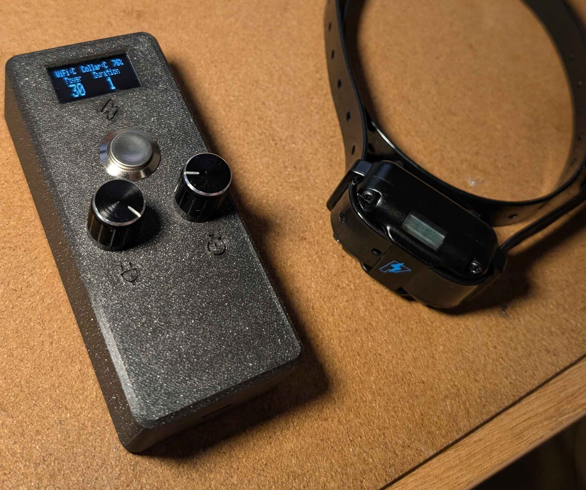
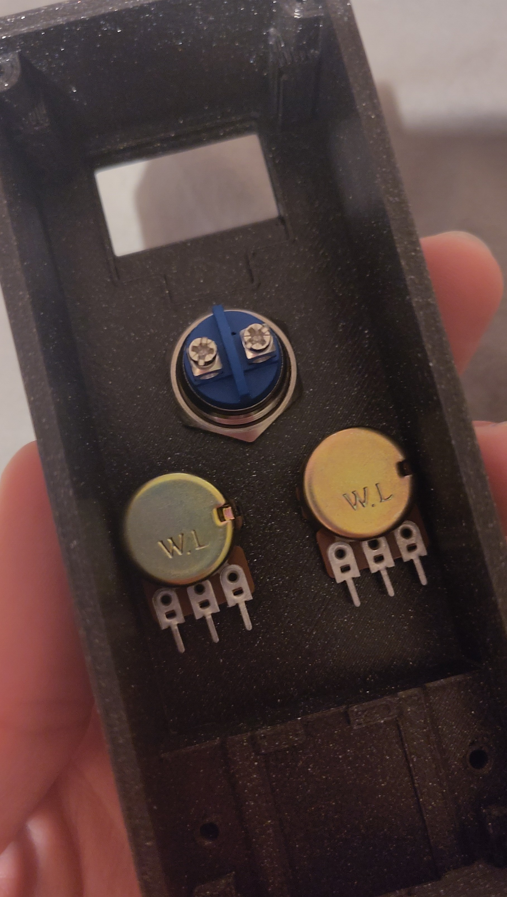
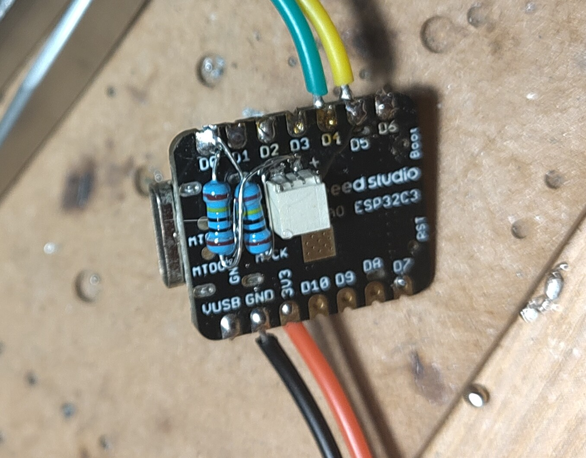
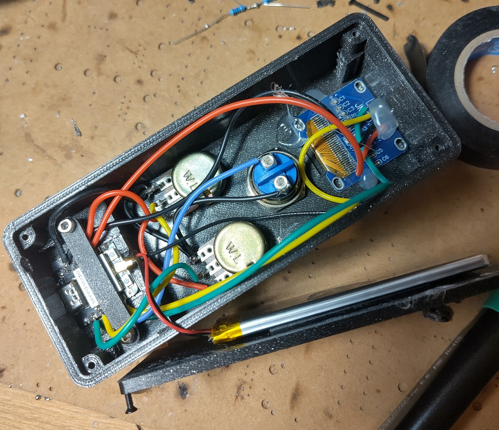

# esp32-pishock-remote

## What Is This?

This is a set of printable STLs and arduino code to send requests to the PiShock API to control a PiShock shock collar. This doesn't replace the standard PiShock base station, that is still required for the collar to work. 
The power and duration can be set with the potentiometers then a short press of the button will make the collar vibrate, if the button is held down for longer than 1.5 seconds then released it will send a shock. The power and duration can be set whilst the button is held down, which can make things rather interesting as whoever is wearing the collar has the anticipation of being zapped.

After 5 minutes of no button activity the remote goes into a deep sleep and the button has to be pressed to wake it up (This doesn't send a shock/buzz)

## What do I need to make one?

This uses half a dozen common parts available on various online marketplaces, I've included links to the specific parts i ordered unless they were random bits i had kicking about

1. A Seeed Studio Xiao ESP32C3 [The Pi Hut](https://thepihut.com/products/seeed-xiao-esp32c3)
1. An SSD1306 128x64 display [Aliexpress](https://www.aliexpress.com/item/1005004355547926.html) (I don't necessarily recommend this one, it arrived with two dead rows)
1. A 16mm Normally open momentary Vandal switch [AliExpress](https://www.aliexpress.com/item/1005006908083042.html)
1. Two potentiometers and a resistor (I used 20k potentiometers and a 4.7k and 470 ohm resistor in series) [AliExpress](https://www.aliexpress.com/item/1005004995929589.html)
1. Two high value resistors (I used 1Mohm)
1. A 3.7v LiPo battery of your choosing
1. M2.5x15 screws x2 (these clamp the ESP into place)
1. M2x10 screws x4 (these hold the base plate on)

You also need some wire to make connections [AliExpress](https://www.aliexpress.com/item/1005008246084449.html) and one each of the three STLs in the [STL](STL/) folder.

## How do I make one

1. Print of all the printed parts. The only place that may need supports are the screw bosses inside the zapper body. Do not use supports on the icons or they'll never look right. You need a clean and sticky build plate for the icons, my first attempt printing these failed because the small inner parts of the icons came up off the bed
1. Check the main components fit in the housing, The ESP32 is a very tight fit on all axes as it needs to handle the cable being flapped around whilst charging, and the locating nubs for the potentiometer are a tight fit. If your printer isn't very accurate this may be tricky, I printed these parts on a Prusa i3 MK3 in galaxy black prusament with no issues

1. Install the potentiometers with their little nuts, and the push button with its nut on the back

  

1. Begin wiring the board. Keep wires as short as possible as it can be a tight fit in the unit once everything is wired up. Whilst it may be tempting, I would advise against soldering things into the Xiao whilst it's mounted in its little pocket, especially if this is printed in PLA as it'll get very melty

    1. Remove header pins from the display if they came preinstalled, and solder connection wires between the ESP32 and the display. Connect the VCC wire from the display to D10 on the ESP32 so it can be powered off when the board goes to sleep, Connect the SDA and SCL pins to D4 and D5 respectively. Connect GND to GND
    1. Connect the left side of the potentiometers and one side of the switch to GND. Whilst the switch has screw terminals you can just solder to the side of the posts instead and then you wont have to worry about the screws rattling loose
    1. Connect the right side of the potentiometers to the potentiometer resistor, then connect the resistor to 3.3v. For the 20k potentiometers I used I selected a 4.7k and 470ohm resistor in series. This brings the max range of the potentiometers to within the measurement range of the ESP
    1. Connect the other side of the switch to D3
    1. Connect the center pin of the potentiometer controlling the power to A1
    1. Connect the center pin of the potentiometer controlling the duration to A2
    1. This step is optional, but if you want to monitor the battery level you need to join the two high value resistors end to end, solder one end to the battery + on the XIAO, one end to the battery - and the midpoint to A0. it is important you keep this as compact as possible as otherwise the XIAO won't fit into its pocket
    1. Solder the battery on. It's recommended you use a connector to keep things neat and allow for unplugging the battery

  

1. Put the display into it's pocket and secure it with some drops of hot glue or other adhesive

1. Put the XIAO into its pocket, it should be a tight fit, it has to be pushed outwards towards the edge of the case to fully seat it around the USB port before the back edge of the XIAO can sit flat. The included antenna can be stuck to the inside of the case and connected to the XIAO

1. Secure the Xiao with the 2 M2.5 screws and the little bar, be mindful not to overtighten the bar and not to pinch any wires.

1. Give the unit a test by flashing it with firmware and confirming that the display comes alive and the dials and buttons all work. The direction and scaling of the dials can be adjusted in firmware, right now you just want to make sure everything works

1. Secure the battery to the inside of the back panel with double stick tape, then secure the back panel in place with 4 M2 screws, one in each corner. Feel free to add some rubber feet to the back panel to prevent the screw heads from scratching any surface it's placed on

## Firmware

This firmware depends on a few libraries:
- Adafruit SSD1306 (and it's dependency Adafruit_Gfx)
- HttpClient
- WiFi
- WiFiClientSecure

You also need the ESP32 core for arduino to select the `XIAO_ESP32C3` board

Basically all of the things you might want/need to configure are available either in [secrets.h](Firmware/secrets.h) or in `#define`s at the beggining of the main [zapper.ino](Firmware/zapper.ino) 

| Value | Location | Meaning|
| --- | --- | ---|
| `ssids` | [secrets.h](Firmware/secrets.h#L4)| Array of WiFi SSIDs the remote will attempt to connect to |
| `passes` | [secrets.h](Firmware/secrets.h#L5)| Array of WiFi passwords corresponding to the `ssids` array |
| `username` | [secrets.h](Firmware/secrets.h#L8)| Username for the PiShock API access, obtain from the PiShock portal |
| `api_key` | [secrets.h](Firmware/secrets.h#L9)| API key for the PiShock API access, obtain from the PiShock portal |
| `dev_code` | [secrets.h](Firmware/secrets.h#L8)| Device code for the PiShock API access, obtain from the PiShock portal |
| `dev_name` | [secrets.h](Firmware/secrets.h#L8)| Device name as reported in the PiShock logs, call this whatever you want |
| `POWER_MAX` | [zapper.ino](Firmware/zapper.ino#L30) | Maximum power the remote will let you send. N.B. there is an additional power limit on the PiShock API|
| `DURATION_MAX` | [zapper.ino](Firmware/zapper.ino#L31) | Maximum duration the remote will let you send. N.B. there is an additional duration limit on the PiShock API|
| `POTENTIOMETER_MAX` | [zapper.ino](Firmware/zapper.ino#L25) | Highest ADC reading the potentiometers will read. Adjust this if full scale on the potentiometer doesn't give you `POWER_MAX` |
| `REVERSE_POTS` | [zapper.ino](Firmware/zapper.ino#L26) | Reverses the direction of the potentiometers if defined, comment out if you want to turn them the other way to change power levels|

The maximum power and duration settings configure what full scale on the potentiometer corresponds to, i.e. if you set `POWER_MAX` to 5, having the potentiometer turned all the way over will read 5 on the display, and the increments get scaled accordingly too.

The firmware has a commented out debug flag [`#define DEBUG`](Firmware/zapper.ino#L10), that if uncommented will print out useful information including the ADC readings, the api request and the api response. If you need to adjust `POTENTIOMETER_MAX` you can uncomment this flag, reflash the firmware, connect to the remote over serial and you should be able to see what the max potentiometer value is on your unit.

## FAQ

1. How good is the battery life?

    I don't know. I put a random 1200mAh battery i had lying around in mine and overnight the battery level decreased by an indicated 2%. There's a non zero current draw from the potentiometers as I dont think the xiao cuts the 3.3v rail in deep sleep, but the heavy consumers should be asleep

1. This 3d model sucks/ this firmware is sloppy

    I went from a blank fusion 360 page to an assembled and working device in about 30 hours including print time and sleeping. Corners were absolutely cut, this is by no means my finest work. This was meant to be a nice fun weekend project and that goal was achieved, if you want to do things better you are absolutely welcome to fork it and make your own or submit a PR to improve this

## Disclaimer

I am not responsible for anything that might happen as a result of using this firmware for any purpose, if you shock yourself too hard and fry your brain that is not my responsibility at all, please be mindful of your body limitations when using any electroshock device